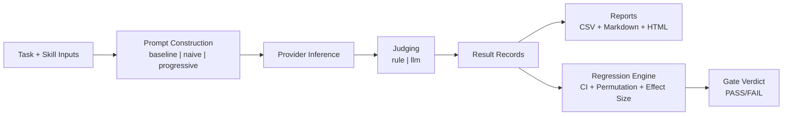

# Architecture Overview

## Pipeline

## Core Components
- `bench/harness.py`: canonical run path for benchmark records.
- `bench/experiment.py`: matrix orchestration, retries, rate limiting, resume checkpointing.
- `bench/regression.py`: statistical analysis and release gate output.
- `bench/report.py`: report generation and static HTML export.
- `bench/cli.py`: user-facing entrypoint and orchestration/gate controls.

## Key Design Decisions
- Keep default runs simple (`skillbench-pd`) while exposing advanced controls via flags.
- Emit both machine-readable and human-readable outputs for gates.
- Favor deterministic behavior for CI where possible (seeded statistical routines).
